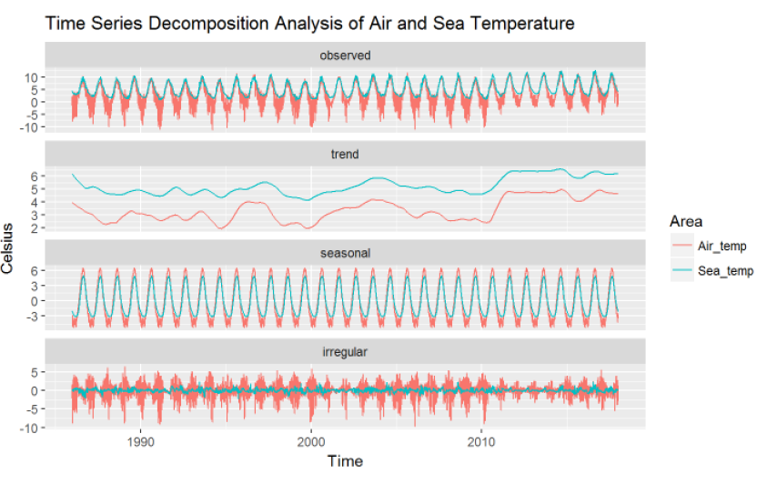

# Buoy & Climate Warming - Data Visualization

A data visualiation of climate warming through buoy collected data.

## Interative Dashboard (Shiny R)

<a href = https://kclt.shinyapps.io/climate_warming> Interactive Dashboard</a>

## Introduction
The National Data Buoy Center (NDBC) is a part of the
National Oceanic and Atmospheric Administration’s (NOAA)
National Weather Service (NWS) of the US government. NDBC deploys weather buoys which are instruments which
collect weather and ocean data within the world’s oceans.

THe aim of this project is to answer the following question:
1. Have the temperatures (both air and sea) increased over the past 30 years? 

## Data
The <a href = https://www.ndbc.noaa.gov/> dataset </a> is from NDBC, and each buoy is their own dataset. As historical standard meteorological data for each respective buoy are stored in separate text file for each separate year, we wrote a script to collect all the data from NOAA website for each buoy for each year and combined it.

| Variable | Description |
| --- | --- |
| `Date` | Date of the  |
| `Air temp` | Air temperature recorded at noon |
| `Sea temp` | Sea temperature recorded at noon |
| `wind speed` | Average wind speed recorded (miles per hour) |

The following, we will look more closely at a specific weather Buoy (46035) located at 57.026 N 177.738 W

## Data Cleaning 

Over the years the date time format of the files has change thus to combine them we have to standardize the inconsistency to allow for time series to make sense. After combining all the files, we noticed that there are missing dates in between the available dates, thus we have to add those back in and also for better time series analysis remove February 29th (leap year). As to conduct any time series analysis, it would require for a full unbroken time series. 

We would thus have to filling in the missing values. Normally we would be able to use conventional methods such as last observation carry forward, but since it is observe there are sustained period (> couple of months) of missing or unavailable data, we would have to use either forecast/imputation to fill in the missing values. 

Here from existing data we observe seasonal trend, we opted to use seasonal decomposed missing value imputation method (Removes the seasonal component from the time series, performs imputation on the deseasonalized series and afterwards adds the seasonal component again). Finally, after all that we generate a csv file that we would be able to use for visualizations.

## Analysis

Due to the effect of seaonality, it is hard to observe whether there is a positive upwards trend. As the upward trend view from an overview maybe caused by seasonality, thus we conduct a time series decomposition, which allows us to seperate the time series into season, trend and residual errors. Then from the trend line, we would be able to observe whether an region has shown an upward increasing trend over the specified time period or not.

Taking a closer at the trend, we fitted linear regressions and find that the slopes are positive and they are statistically significant. Thus we conclude that Global warming did exist as the temperatures (both sea and air) increased over the past 30 years.

## Robustness Check

To check whether sampling affected our evaluation of temperature change, lets conduct a simple robustness check temperature at 0:00, 6:00, 18:00 and compare with 12:00

Similar results and conclusions have been obtained as
compared to the noon time data.

